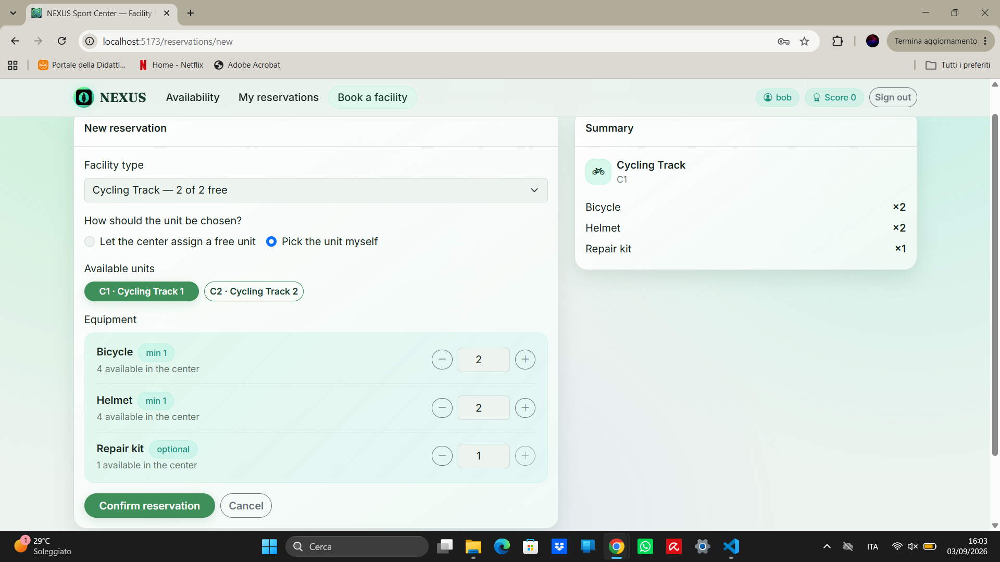

# Exam #3: "Sport"
## Student: s364230 OLIVE SIMONE

## React Client Application Routes

- Route `/` — Public home page showing the current availability of facilities and rental equipment.

- Route `/login` — Login page for username/password authentication.

- Route `/login/totp` — Second authentication step where the user can enter a TOTP code or continue without 2FA.

- Route `/reservations` — Shows the authenticated user's active reservations and allows their equipment to be modified or the reservations to be deleted.

- Route `/reservations/new` — Allows the authenticated user to create a new reservation through automatic facility assignment or direct selection of a specific available facility.

- Route `*` — Fallback route displaying the not-found page for unknown URLs.

## API Server

- `GET /api/facilities`
  - Returns all facility types with their total and currently available units, together with the equipment rules associated with each type.

- `GET /api/facility-types/:id/facilities`
  - Returns the individual facilities belonging to the facility type identified by `id`, including their code, name and current availability.

- `GET /api/equipment`
  - Returns all equipment types with their total quantity and currently available quantity across the sport center.

- `POST /api/sessions`
  - Authenticates a user using `{ username, password }` and creates a session.
  - Returns `{ id, username, score, canDoTotp, isTotp }`.

- `POST /api/login-totp`
  - Verifies the TOTP second authentication step for an already authenticated user.
  - Receives `{ code }` and, on success, resets the user's score to `0`.

- `GET /api/sessions/current`
  - Returns information about the currently authenticated user as `{ id, username, score, canDoTotp, isTotp }`.

- `DELETE /api/sessions/current`
  - Logs out the current user and terminates the authenticated session.

- `GET /api/reservations`
  - Returns all active reservations of the authenticated user.
  - Each reservation contains facility information and its rented equipment.

- `POST /api/reservations`
  - Creates a reservation for the authenticated user using either automatic selection (`{ mode: "auto", facilityTypeId, equipment }`) or direct selection (`{ mode: "direct", facilityCode, equipment }`).
  - `equipment` is a list of items in the form `{ equipmentTypeId, quantity }`.

- `PATCH /api/reservations/:id`
  - Replaces the complete equipment list of the reservation identified by `id`, if owned by the authenticated user.
  - Receives `{ equipment: [{ equipmentTypeId, quantity }, ...] }`.

- `DELETE /api/reservations/:id`
  - Soft-deletes the reservation identified by `id`, if owned by the authenticated user, releasing its facility and equipment and decreasing the user's score by one.

## Database Tables

- Table `users` — Stores application users, authentication data, score and TOTP information. Columns: `id` (PK), `username` (unique), `hash`, `score`, `totp_secret`, `password_salt`, `last_totp_step`.

- Table `facility_types` — Stores the available categories of sport facilities. Columns: `id` (PK), `name` (unique).

- Table `facilities` — Stores each physical facility available in the sport center. Columns: `id` (PK), `code` (unique), `facility_type_id` (FK), `name`.

- Table `equipment_types` — Stores each rentable equipment type and its global stock. Columns: `id` (PK), `name` (unique), `total_quantity`.

- Table `facility_equipment` — Associates facility types with their allowed equipment and required minimum quantities. Columns: `facility_type_id` (FK), `equipment_type_id` (FK), `minimum_quantity`; composite PK: (`facility_type_id`, `equipment_type_id`).

- Table `reservations` — Stores reservations and their soft-deletion history. Columns: `id` (PK), `user_id` (FK), `facility_id` (FK), `created_at`, `deleted_at`.

- Table `reservation_equipment` — Stores the equipment quantities assigned to each reservation. Columns: `reservation_id` (FK), `equipment_type_id` (FK), `quantity`; composite PK: (`reservation_id`, `equipment_type_id`).

The database also defines the `trg_reservation_soft_delete_score` trigger, which decreases the user's score by one whenever an active reservation is soft-deleted.

## Main React Components

- `App` (in `App.jsx`) — Main application component managing routing, authentication state, availability data, reservations and global feedback.

- `Layout` (in `components/Layout.jsx`) — Common application layout containing the navigation bar, global feedback area, page content and footer.

- `HomePage` (in `pages/HomePage.jsx`) — Public page showing the current availability of facilities and rental equipment.

- `LoginPage` (in `pages/LoginPage.jsx`) — Handles username/password authentication.

- `TotpPage` (in `pages/TotpPage.jsx`) — Handles the optional TOTP second authentication step.

- `ReservationsPage` (in `pages/ReservationsPage.jsx`) — Displays the authenticated user's active reservations and allows equipment modification and reservation deletion.

- `NewReservationPage` (in `pages/NewReservationPage.jsx`) — Handles the creation of new reservations, including facility selection mode and equipment quantities.

- `EquipmentPicker` (in `components/EquipmentPicker.jsx`) — Reusable component for selecting the equipment quantities associated with a reservation.

- `EditEquipmentModal` (in `components/EditEquipmentModal.jsx`) — Modal used to modify the equipment associated with an existing reservation.

## Screenshot

## Users Credentials

- Username: `alice`; Password: `Wonderlands1!`; Active reservations: 0; Initial score: 0.

- Username: `bob`; Password: `Basketball2!`; Active reservations: 1; Initial score: 0; Reserved facility: `Tennis Court 1`.

- Username: `carol`; Password: `Tennis3!`; Active reservations: 1; Initial score: -5; Reserved facility: `Basketball Court 1`.

- Username: `dave`; Password: `Soccer4!`; Active reservations: 2; Initial score: -2; Reserved facilities: `Volleyball Court 1`, `Table Tennis Table 1`.
